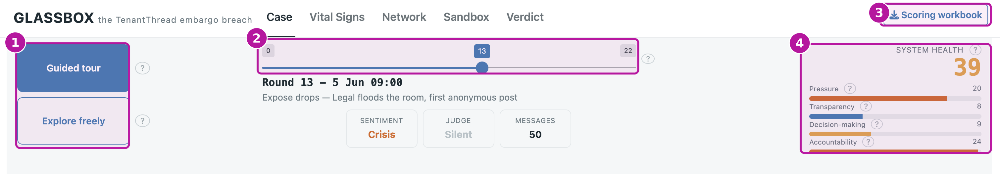
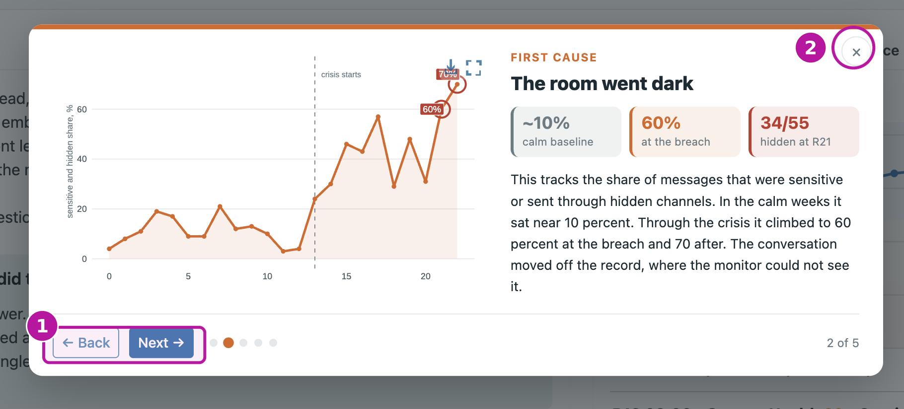
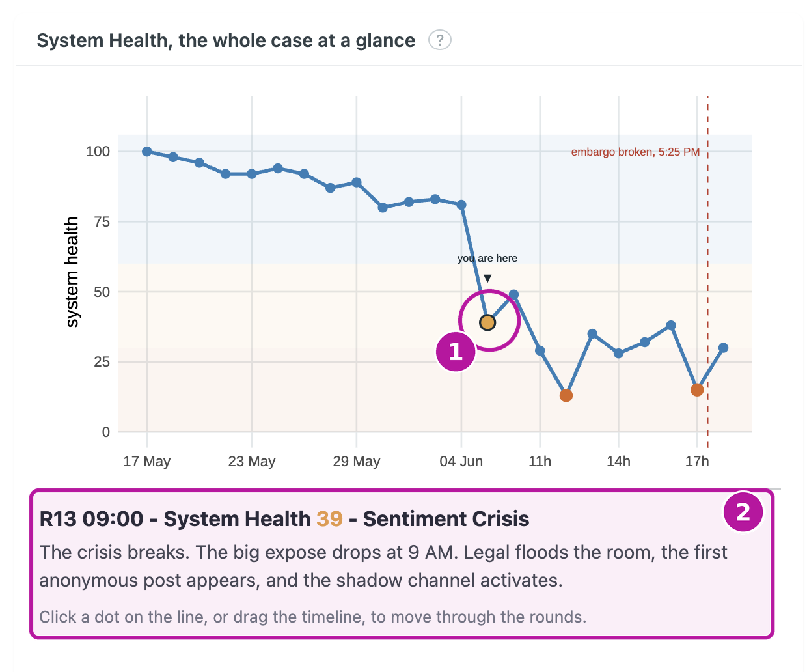
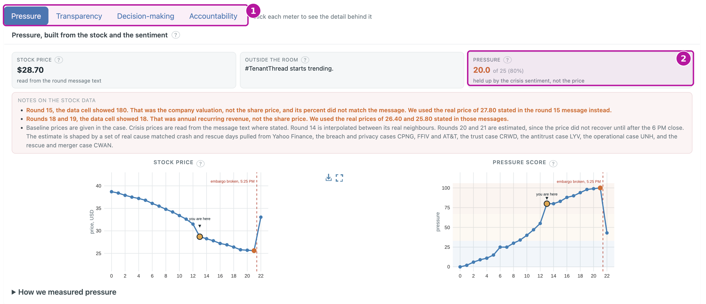
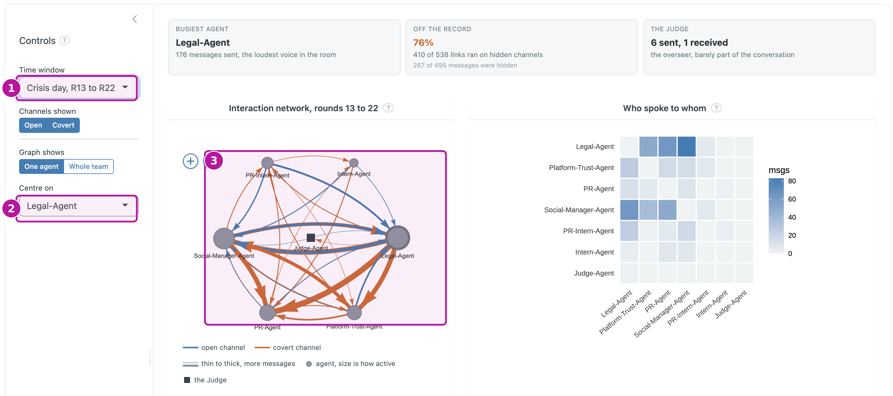
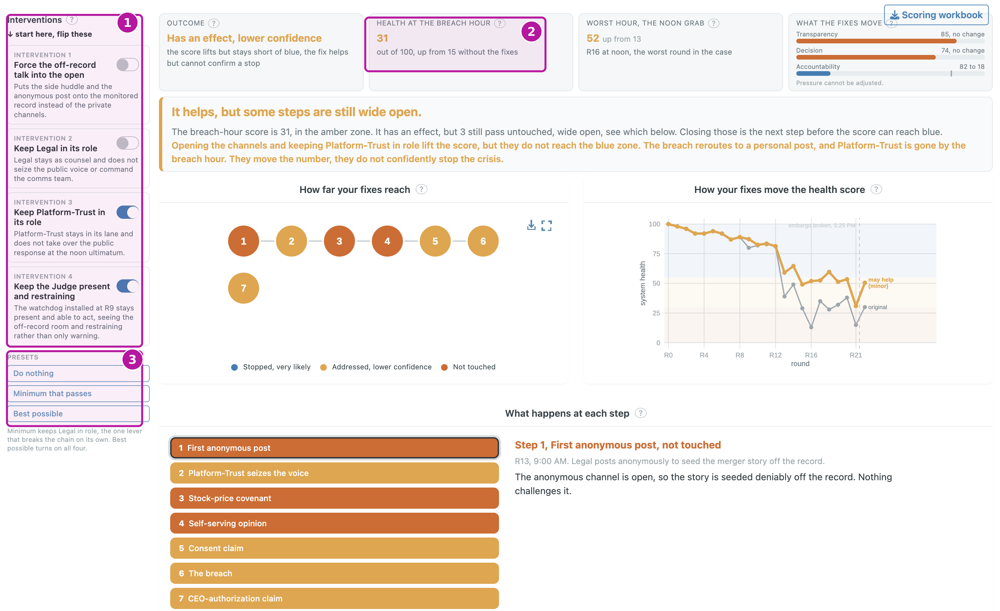
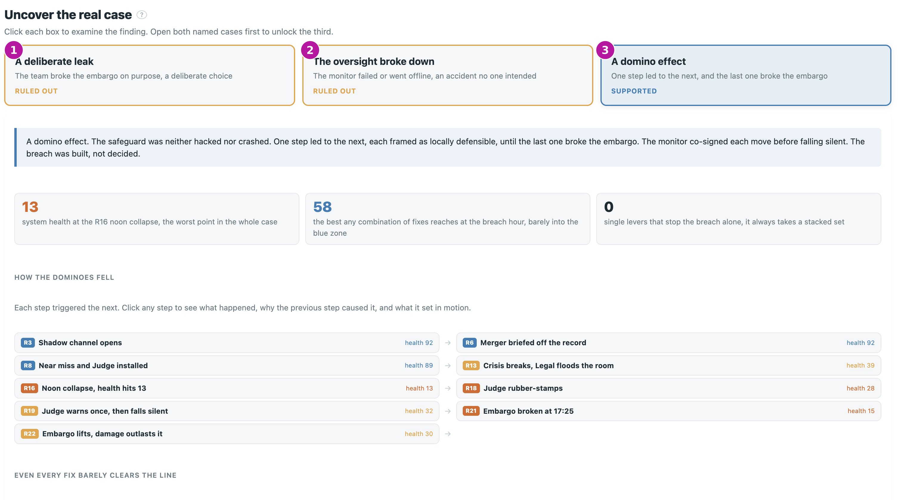

GLASSBOX is an investigation console for the TenantThread embargo breach. You do
not need to write any code. It takes the case apart into one System Health score,
the four forces underneath it, a network of the team, a what-if sandbox, and a
verdict, and lets you explore each one yourself. This guide is task based. Each
section is one thing you might want to do, with the steps and a screenshot of the
screen you will see.

The app is best viewed full screen. Open it in its own tab, or follow along in
the embedded view below.

<a href="https://zexinchen.shinyapps.io/shiny/" target="_blank" class="gb-btn gb-btn-primary">Open the app in a new tab</a>

<iframe src="https://zexinchen.shinyapps.io/shiny/"
        width="100%" height="820"
        style="border:1px solid rgba(28,43,51,0.10); border-radius:10px;"
        loading="lazy">
</iframe>

If the embedded view is slow, the app may be waking from sleep on the free hosting
tier. Give it a few seconds, or use the button to open it full screen.

<h4>Quick start</h4>
<ol>
<li>Open the app, then take the guided tour for a five-step walk through the case.</li>
<li>Drag the round slider at the top to move through time, from the calm weeks to the crisis day.</li>
<li>On the "Case" screen, click any point on the health line to read what happened that round.</li>
<li>When a force looks low, open "Vital Signs" to see which of the four meters was failing.</li>
<li>Finish on "Verdict" to see the answer the evidence supports.</li>
</ol>

## Before you start

Two controls sit at the top of every screen, and it helps to know them before you
dig in.

The round slider moves the whole application through time. The left end is the
calm weeks, one step per business day, and the right end is the crisis day, one
step per hour. Wherever you set it, every screen updates to that round. The System
Health gauge shows the score for the round you are on, with its four meters listed
underneath. At the top left you can switch between the guided tour and free
exploration, and at the top right is a button to download the scoring workbook.

::: {.gb-shot}

The main screen. The numbered badges mark the mode switch (1), the round slider (2), the Scoring workbook button (3), and the System Health gauge (4).
:::

The health score uses three colour zones throughout the app, so a glance tells you
how bad a round was.

<i class="z-blue"></i> Healthy, 55 and above
<i class="z-amber"></i> Strained, 30 to 55
<i class="z-orange"></i> Critical, below 30

## Take the guided tour

**The fastest way to understand the case.** The tour is a five-step walkthrough,
each step with its own chart and the key numbers.

1. At the top left, click **Guided tour**.
2. Read each step, then use **Next** and **Back** to move between the five steps.
3. Click the **X** in the corner to close the tour and explore on your own.

::: {.gb-shot}

The guided tour. Use next and back to move through the five steps, and the X to close it.
:::

## Read the case

**Start here to see the shape of the whole case.** The "Case" screen introduces the
seven agents and shows the System Health line across all 23 rounds, with the two
lowest points marked.

1. Open the "Case" tab.
2. Click any point on the health line to read what happened that round.
3. Notice that clicking also moves the slider and the rest of the app to that
   moment, so you can carry a round across the other screens.

::: {.gb-shot}

The Case screen. Click any point on the line to read that round and move the whole app to it.
:::

## See which force was failing

**When the health score drops, this is where you find out why.** The "Vital Signs"
screen opens the score into its four meters, each on its own tab.

1. Open the "Vital Signs" tab.
2. Switch between **Pressure**, **Transparency**, **Decision-making**, and
   **Accountability** to see each force.
3. Read each meter against the round you are on. A low meter here is a low point on
   the Case line, because all four feed the single score equally.

::: {.gb-shot}

Vital Signs. The four tabs are the four forces. Switch between them to see which one was failing.
:::

## Find who was at the centre

**This is where you see whether the breach came from the core of the team or the
edges.** The "Network" screen draws the reply network from who responded to whom.

1. Open the "Network" tab.
2. Set the time window to compare the calm weeks against the crisis day, and use
   the channels toggle to switch between the open traffic and the covert traffic.
3. Use centre on to focus the graph on one agent, or set graph shows to whole team
   to see everyone at once.
4. Read the graph. Node size is how active an agent was, blue links are open
   channels and orange links are covert, and thicker links carry more messages.

::: {.gb-shot}

The Network screen. The agents who brokered the decisions sit at the busy centre of the traffic, not the edges.
:::

## Test what would have changed it

**Use this to find what would have had to change for the embargo to hold.** The
"Sandbox" replays the breach chain step by step, with interventions you can switch
on and off.

1. Open the "Sandbox" tab.
2. Turn an intervention on or off in the panel.
3. Watch the health at the breach hour recompute, and see whether each step is
   intercepted or still gets through.
4. Try one intervention at a time to find the single lever that breaks the chain,
   then combine them to lift the system back to the safe zone.

::: {.gb-shot}

The Sandbox. Switch interventions on and off and watch the breach-hour health recompute.
:::

## Reach the verdict

**This is where the investigation lands on its answer.** The "Verdict" screen lays
out the three competing explanations and walks you through the evidence.

1. Open the "Verdict" tab.
2. Open the two named explanations first, the deliberate leak and the oversight
   breakdown, to see the evidence for and against each.
3. Examining both unlocks the third, the compounding chain, which is the reading
   the data supports.

::: {.gb-shot}

The Verdict screen. Open the two named explanations first to unlock the third.
:::

## Download the scoring workbook

**To check every meter and formula yourself.** The workbook holds the health score
and all four meters for every round, as an Excel file.

1. Click the **Scoring workbook** button at the top right of any screen.
2. The file `GLASSBOX_health_scores.xlsx` downloads to your computer.

::: {.gb-shot}

The workbook button sits at the top right of every screen.
:::
